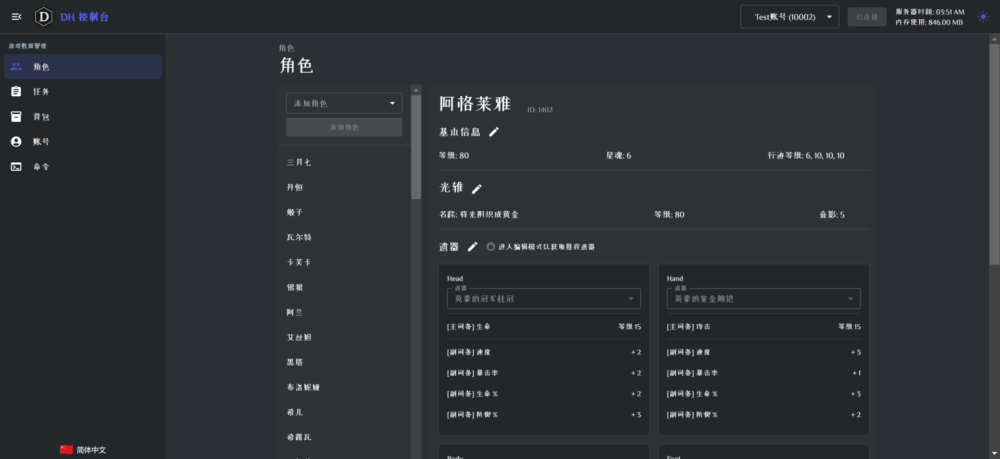
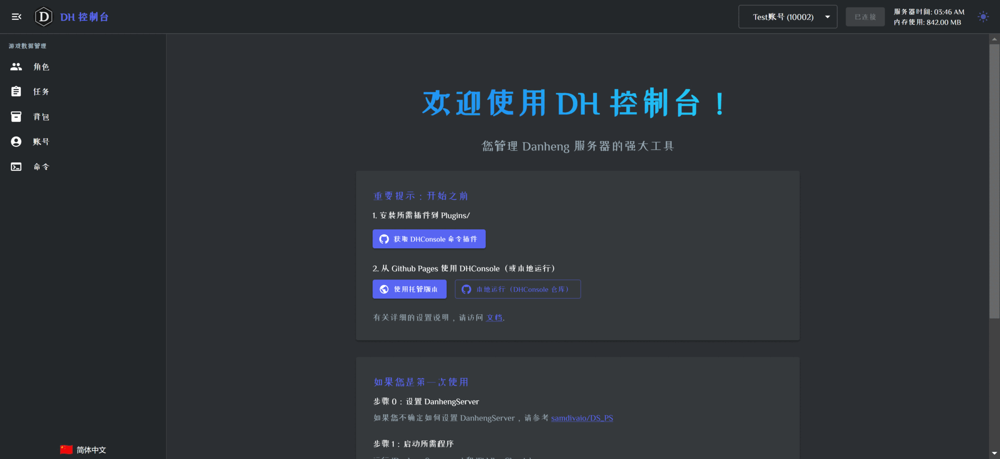
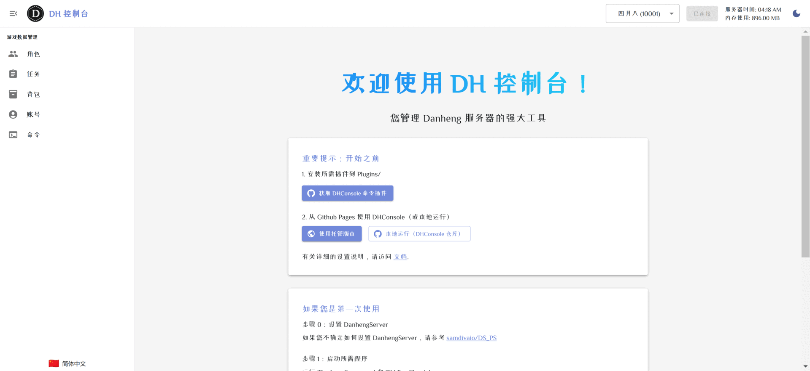

# DHConsole

A local web app to control Danheng Server via UI with full i18n support.

Visit https://anyrainel.github.io/DHConsole/ to use the latest version.

## Features

- [x] Character Management: Stats, Light Cone, Relics, etc.
- [x] Relic Management (pick your affixes and upgrades, or let DHConsole recommend for you)
- [x] Mission Management (pick missions to skip)
- [x] Inventory Management (send more items to inventory)
- [x] Account level, gender and other controls
- [x] Custom Commands



Some features still have bugs (e.g. remove unused equipment), and I'm working on fixing them.

### Full i18n support


### Dark / Light Color Theme


## Usage

### Prerequisite

- Download plugin dll from [DanhengPlugin-DHConsoleCommands](https://github.com/Anyrainel/DanhengPlugin-DHConsoleCommands).
- Place the dll in the `Plugins` folder of your Danheng Server.

### Option 1: Use github pages

- Open [DHConsole](https://anyrainel.github.io/DHConsole/) in your browser.

### Option 2: Clone and run via npm

```bash
git clone https://github.com/Anyrainel/DHConsole.git --depth 1
cd DHConsole
npm install
npm run dev
```

Then open the url from the terminal output.

### Tips

Remember to click the `Connect` button after opening the page. You will need to find the `config.json` file from your private server to initiate the connection.

The connection with Danheng Server can sometimes be unstable, you might need to connect again if the connection is lost.

## Questions
Open new issues in this repo.